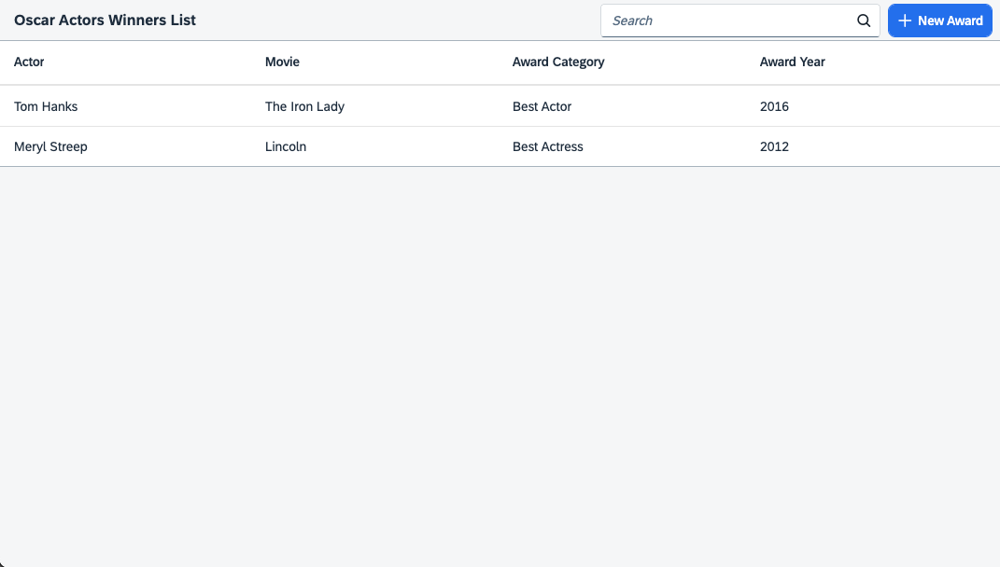
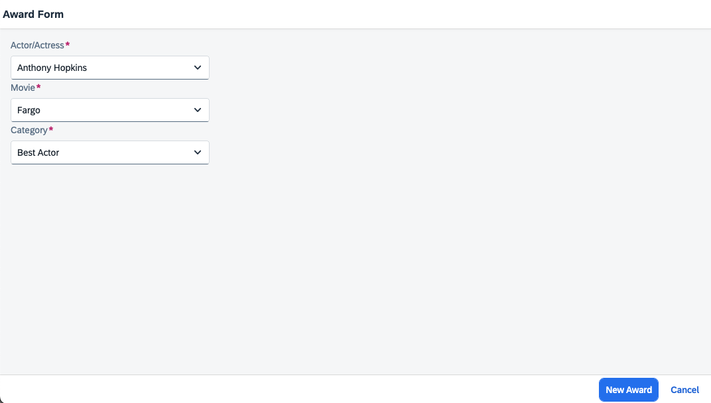

# Oscar Challenge

## Table of Contents

- [Pre-requisites](#prerequisites)
- [How to Run](#how-to-run)
- [Challenge Description](#challenge-description)
  - [List of Winners](#list-of-winners)
  - [New Awards](#new-awards)
  - [Edit Awards](#edit-awards)

## Prerequisites

- Install [node and npm](https://docs.npmjs.com/downloading-and-installing-node-js-and-npm).
- Install `npm add -g @sap/cds-dk`

## How to Run

To run the application, you can simply run `npm run start` or `npm run start:ts`, both will work correctly.

> [!CAUTION]
>
> - Windows OS can have problems with node_modules path, if it happens, it's recommended to use `npm run start` to run the application.
> - If `npm run start` does not start with the .ts service, please run `npm run start:ts` it will force the application to use the .ts service.

## Challenge Description

This project involves developing an application using the **UI5 framework**, with the goal of managing the Best Actor and Best Actress awards for the Oscars. The application should include various features, providing an interface as shown in the screenshots below.

> [!TIP]  
> The backend is already implemented, and you can refer to it to understand how to consume it correctly. Inside the `./docs/api` folder, you can find the existing APIs in the project using Swagger.

### List of Winners

The application should display a list of winners for the Best Actor and Best Actress categories, presenting information such as the winner's name, the movie for which they were awarded, the category, and the award year. To facilitate navigation, the application must include filtering capabilities based on criteria such as category, person’s name, or movie title. Additionally, the list should be sorted in descending order by award year.

### New Awards

A key feature will be the creation of new awards. On the home screen, there should be a button allowing the user to start the award creation process. Clicking this button will navigate the user to a page where they can select the winner, enter the associated movie, and choose the corresponding category—either Best Actor or Best Actress. The award year should be automatically filled with the current year.

### Edit Awards

It is also possible to edit an existing award. To do so, the user must click on a row in the table on the main screen, which will navigate them to a form identical to the award creation screen. The only UI difference will be that the button text changes from 'New Award' to 'Save'.

The application should be implemented using the internationalization features provided by UI5. You are responsible for deciding how to handle aspects not explicitly mentioned above, such as route configuration.

> [!IMPORTANT]
>
> - A well-structured **README.md** file is expected, including instructions on how to run and test the application, as well as explanations of relevant architectural decisions made during development. You may replace the content of this README with the documentation of your project.
> - The final solution and documentation should be delivered via a link to your public Git repository.
